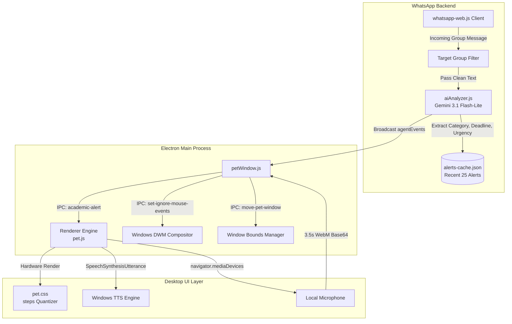

<div align="center">

# 🐾 Grumphy

### *Your Intelligent, All-in-One Desktop Companion & Academic Watchdog*

[](https://microsoft.com/windows)
[](https://www.electronjs.org/)
[](https://nodejs.org/)
[](https://ai.google.dev/)
[](LICENSE)

<br/>

> **Grumphy** is a floating, transparent pixel-art desktop pet that lives in the corner of your screen. Behind its cute, cozy animations is an autonomous AI agent that monitors your WhatsApp groups 24/7 for assignments, exam notices, lab submissions, and deadlines — alerting you with spoken voice announcements and animated reactions in real-time.

<br/>

```
      /\_/\   
     ( o.o )  "Psst! Physics Assignment 3 is due tomorrow at 11:59 PM!"
      > ^ <   
```

---

</div>

## 🌟 Key Highlights

- 🪟 **True Transparent Canvas & Click Pass-Through**: Grumphy floats seamlessly above your desktop without blocking background apps. Clicks in transparent empty space pass straight through to Chrome, VS Code, or desktop shortcuts via dynamic `setIgnoreMouseEvents`.
- 🎮 **Hardware-Accelerated Sprite Engine**: Hand-crafted CSS `@keyframes` and `steps(N)` quantization tailored to the exact frame counts of every action row — 100% zero-gap looping with no blank frame flashes or flickering.
- 📱 **Real-Time WhatsApp Sentinel**: Connects directly to WhatsApp Web via `whatsapp-web.js` to scan designated academic group chats for announcements, exams, viva schedules, and assignments.
- 🧠 **Gemini Multimodal Intelligence**: Powered by `gemini-3.1-flash-lite` to classify incoming messages into structured JSON, extract exact deadlines, evaluate urgency, and filter out casual chat banter.
- 🎙️ **Conversational Push-to-Talk**: Press `Ctrl + Shift + Space` or click Grumphy to speak via your microphone. Grumphy queries its local alert cache, consults Gemini, and answers questions about upcoming deadlines using native Text-to-Speech (TTS).
- 🖱️ **Decoupled Physics & Interactions**: Decoupled from native OS drag limitations so you can drag Grumphy anywhere, hover over him to watch him wave, or double-click to watch him sprint across your screen.

---

## 🎭 Grumphy's Action States

Grumphy's animations are mapped to a consolidated WebP spritesheet (`./sprites/spritesheet.webp`) running at cozy, companion-grade framerates:

| Row | Action | Trigger / Event | Valid Frames | Timing |
|:---:|:---|:---|:---:|:---:|
| **1** | **IDLE** | Default state when resting on desktop | 6 frames | `1.4s infinite` |
| **2** | **RUN RIGHT** | Dragging mascot window to the right ($dx > 2$) | 8 frames | `0.9s infinite` |
| **3** | **RUN LEFT** | Dragging mascot window to the left ($dx < -2$) | 8 frames | `0.9s infinite` |
| **4** | **WAVING** | Mouse cursor hovering over the mascot | 4 frames | `1.1s infinite` |
| **5** | **JUMP** | Incoming WhatsApp academic alert received | 5 frames | `0.8s infinite` |
| **6** | **FAILED** | Speech recognition / microphone error or no audio | 8 frames | `1.5s infinite` |
| **7** | **WAITING** | Microphone actively listening to user voice query | 6 frames | `1.3s infinite` |
| **8** | **RUNNING** | Playful reaction triggered by **Double-Click** | 6 frames | `0.6s infinite` |
| **9** | **REVIEW** | AI thinking / TTS reading deadline out loud | 6 frames | `1.2s infinite` |

---

## 🕹️ Controls & Gestures

| Action | Control | Description |
|:---|:---|:---|
| **Wave** | `Hover` | Move your mouse over Grumphy to see him wave hello. |
| **Drag & Move** | `Click + Drag` | Pick up Grumphy and move him anywhere on your screen. He runs in the direction he is pulled! |
| **Sprint** | `Double-Click` | Double-click Grumphy to trigger a rapid sprint animation for 2 seconds. |
| **Voice Chat** | `Click` or `Ctrl+Shift+Space` | Activates push-to-talk microphone. Grumphy listens for 3.5s and speaks the answer. |
| **Dismiss Bubble** | `Click Bubble` | Click the floating frosted-glass notification bubble to dismiss it immediately. |
| **Context Menu** | `Right-Click` | Opens the native desktop menu with options to **Mute Audio**, **Reset Position**, or **Exit**. |

---

## 🏗️ Architecture & Data Flow



---

## 🚀 Getting Started

### Prerequisites

- **Windows 10 / 11**
- **Node.js 18+** or **Node.js 20+**
- A Google Gemini API key ([Get one for free at Google AI Studio](https://aistudio.google.com/))
- A WhatsApp account on your smartphone

### Installation

1. **Clone the repository:**
   ```bash
   git clone https://github.com/cryoxyl-beep/Grumphy.git
   cd Grumphy
   ```

2. **Install project dependencies:**
   ```bash
   npm install
   ```

3. **Configure your `.env` file:**
   Create a `.env` file in the project root:
   ```env
   # Your Google Gemini API Key
   GEMINI_API_KEY=your_gemini_api_key_here

   # Comma-separated list of WhatsApp group names to monitor
   TARGET_GROUPS="CSE-A - 2026-30, Academic Circulars, 26-30 Batch GCET"

   # Logging level (debug, info, warn, error)
   LOG_LEVEL=info
   ```

4. **Launch Grumphy:**
   ```bash
   npm run electron
   ```

> 📱 **First-Time QR Login**: On the initial run, a WhatsApp QR code will be generated in your terminal. Open WhatsApp on your phone > **Linked Devices** > **Link a Device** and scan the code. Your session is saved securely in `./.wwebjs_auth/` so you won't need to scan it again!

---

## 🧪 Running Automated Tests

Grumphy includes a built-in regression test suite verifying spritesheet asset geometry, CSS frame calculation parity, and Electron IPC handlers:

```bash
npm test
```

Expected output:
```
========================================
Running Principal Architect Verification
========================================

[PASS] Spritesheet asset exists and matches 1536x1872 (8x9 frames)
[PASS] index.html structure has div#pet-sprite and speechBubble without img#pet-character
[PASS] pet.css has correct keyframe math, scale, and cozy frame timings
[PASS] petWindow.js IPC move-pet-window and window-move work with both object and numeric args
[PASS] Live Electron window execution: boot click-through, state machine, drag, bubble

========================================
Results: 5 PASSED, 0 FAILED
========================================
```

---

## 📁 Project Structure

```
Grumphy/
├── .env.example             # Template for API keys and group names
├── .gitignore               # Ignores credentials, node_modules, and cache
├── agent.js                 # Background WhatsApp monitoring agent & event emitter
├── aiAnalyzer.js            # Gemini 3.1 Flash-Lite schema analysis & voice query handler
├── alertsCache.js           # Lightweight JSON circular cache (last 25 alerts)
├── config.js                # Environment configuration loader
├── ecosystem.config.js      # PM2 background process manager config
├── index.html               # Semantic viewport with frosted-glass speech bubble
├── package.json             # NPM scripts, dependencies & Electron configuration
├── pet.css                  # Pixel-perfect CSS steps() engine & glassmorphism UI
├── pet.js                   # Client-side state machine, TTS, voice recorder & drag physics
├── petWindow.js             # Electron main process, global hotkeys, click pass-through
├── test-verification.js     # Headless Electron verification suite
└── sprites/
    └── spritesheet.webp     # Consolidated 1536x1872 master character sheet (8x9)
```

---

## 🔮 Future Roadmap

- [ ] **Telegram & Discord Integrations**: Unified multi-channel alerts in one desktop companion.
- [ ] **Custom Skins & Costumes**: Community-driven Shimeji skin loader and custom sprite sheets.
- [ ] **Direct Notion / Google Calendar Sync**: Auto-export detected deadlines directly to your calendar.
- [ ] **Task Completion Rewards**: Earn cute animations and XP when you mark assignments as complete!

---

<div align="center">

Crafted with ❤️ and Gemini AI. Keep your desktop lively and your assignments on time!

</div>
